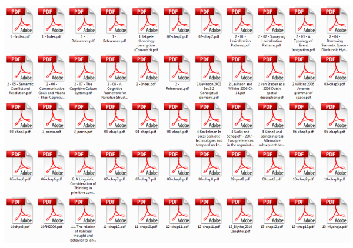
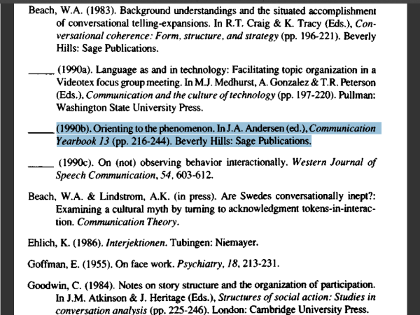
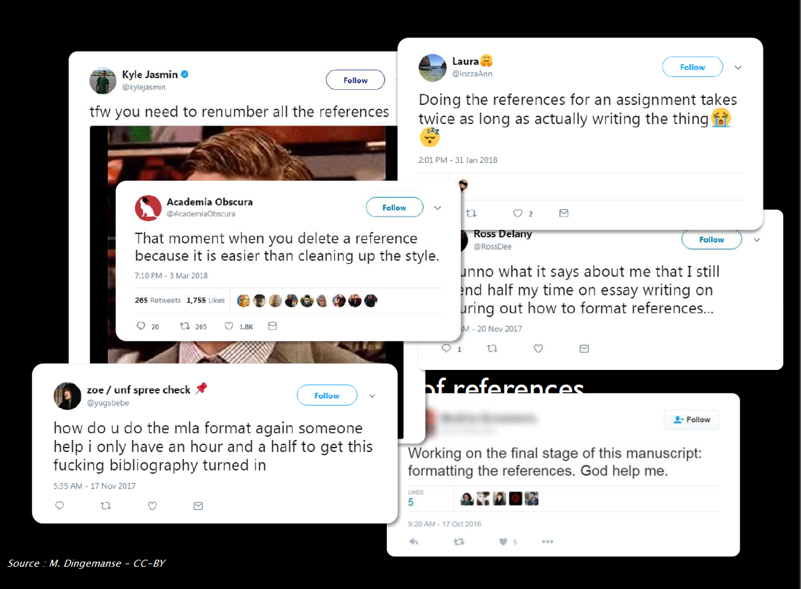
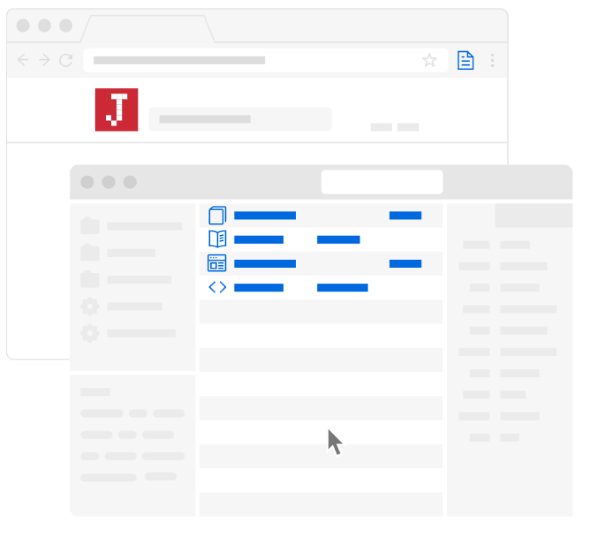
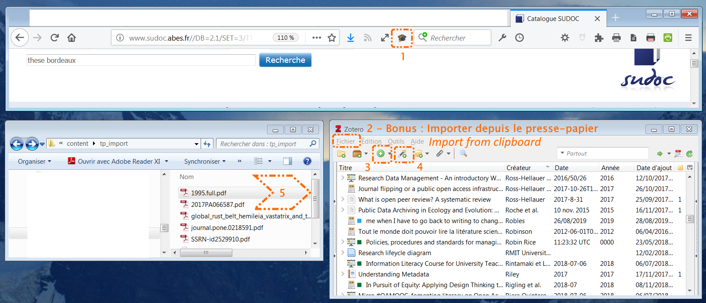
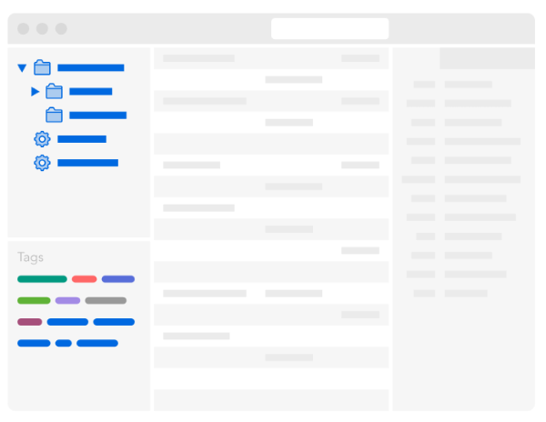
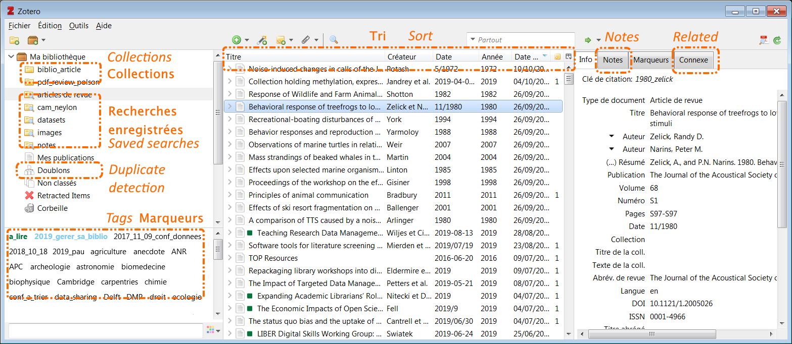
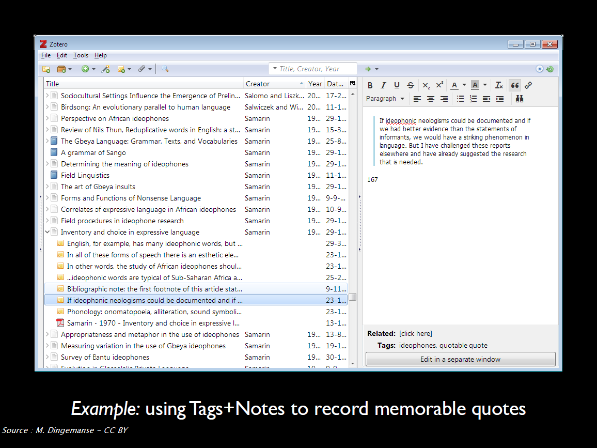
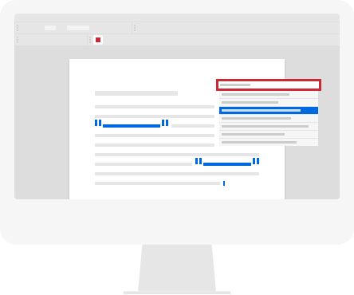

# Introduction à Zotero, votre assistant de recherche personnel

_Ce support de formation est traduit et adapté des 2 ressources suivantes, publiées sous la licence Creative Commons CC-BY._

Dingemanse, M. (2018, mars). _Collecting, organizing and citing scientific literature : An intro to Zotero_. https://speakerdeck.com/markding/collecting-organizing-and-citing-scientific-literature-an-intro-to-zotero

EPFL Library Teaching Team. (2020). _Up to speed with Zotero [course notes]_. https://fbib.gitbooks.io/up-to-speed-with-zotero/content/

L'icône ![zotero][zotero] signale la documentation officielle Zotero, y compris les discussions du forum Zotero : c'est la meilleure source d'information et d'aide!

## Objectifs

* Créer et organiser une bibliothèque de références bibliographiques et de PDF avec Zotero
* Rédiger un document en générant automatiquement les citations et la bibliographie en fonction des normes Vancouver et/ou APA
* Comprendre l'environnement de Zotero pour en optimiser et en augmenter l'usage

## Sommaire

<!-- MDTOC maxdepth:2 firsth1:0 numbering:0 flatten:0 bullets:1 updateOnSave:1 -->

- [Objectifs](#objectifs)   
- [Sommaire](#sommaire)   
- [1. Introduction](#1-introduction)   
   - [Peut-être procédez-vous de la façon suivante?](#peut-être-procédez-vous-de-la-façon-suivante)   
   - [Zotero?](#zotero)   
- [2. Installer et configurer Zotero](#2-installer-et-configurer-zotero)   
   - [Comment vérifier si l'installation a fonctionné ?](#comment-vérifier-si-linstallation-a-fonctionné)   
   - [Conseils pour configurer Zotero](#conseils-pour-configurer-zotero)   
- [3. Constituer sa bibliothèque Zotero étape 1, ajouter des documents et des fichiers](#3-constituer-sa-bibliothèque-zotero-étape-1-ajouter-des-documents-et-des-fichiers)   
   - [Enregistrer des documents dans votre navigateur](#enregistrer-des-documents-dans-votre-navigateur)   
   - [Exercice 3-1, enregistrer des documents depuis les sites en ligne avec le connecteur Zotero](#exercice-3-1-enregistrer-des-documents-depuis-les-sites-en-ligne-avec-le-connecteur-zotero)   
   - [Toutes les méthodes d'ajout](#toutes-les-méthodes-dajout)   
   - [Exercice 3-2, essayer une autre méthode d'ajout](#exercice-3-2-essayer-une-autre-méthode-dajout)   
   - [Vérifier et mettre à jour les documents que vous avez enregistrés](#vérifier-et-mettre-à-jour-les-documents-que-vous-avez-enregistrés)   
- [4. Constituer sa bibliothèque Zotero étape 2, organiser le contenu](#4-constituer-sa-bibliothèque-zotero-étape-2-organiser-le-contenu)   
   - [Outils pour organiser votre bibliothèque](#outils-pour-organiser-votre-bibliothèque)   
   - [Exercice 4-1, démarrer avec l'organisation](#exercice-4-1-démarrer-avec-lorganisation)   
   - [Aller plus loin](#aller-plus-loin)   
- [5. Citer avec Zotero](#5-citer-avec-zotero)   
   - [Les styles bibliographiques](#les-styles-bibliographiques)   
   - [Exercice 5-1, citer dans un fichier de traitement de texte](#exercice-5-1-citer-dans-un-fichier-de-traitement-de-texte)   
   - [Autres fonctionnalités de citation](#autres-fonctionnalités-de-citation)   
- [6. Questions, étapes suivantes et conclusions](#6-questions-étapes-suivantes-et-conclusions)   
   - [Etapes suivantes](#etapes-suivantes)   
   - [Assistance](#assistance)   

<!-- /MDTOC -->

## 1. Introduction

### Peut-être procédez-vous de la façon suivante?
#### Etape 01, collecter la biblio

****

#### Etape 02, organiser la biblio

****

#### Etape 03, citer ses sources

#### Et peut-être rencontrez-vous aussi les difficultés suivantes?

* Des tas de PDF en vrac avec des noms incompréhensibles
* Aucun lien entre vos références bibliographique, vos fichiers et vos notes
* Le copier-coller comme meilleure option lorsque vous effectuez des citations
* La nécessité de remettre en forme manuellement vos références

Bref :

En version animée :

Robles, J. S. (2019, août 26). Me when I have to go back to writing to change the style &amp; references #AcademicLife https://t.co/tFYWKZAkVa [Twitter]. _@DoctorJRo_. https://twitter.com/DoctorJRo/status/1166056789642625024

### Zotero?

#### Vue d'ensemble

Zotero est un **logiciel de gestion bibliographique**. Lorsque vous utilisez un logiciel de ce type, les tâches suivantes sont (plus ou moins) un processus en 1 clic :

* ajouter/importer des références bibliographiques,
* créer une bibliographie,
* citer au fil de l'écriture d'un mémoire, d'un article.

Toutes ces tâches techniques sont effectuées par le logiciel, mais souvenez-vous que **vous êtes le cerveau**. Cela signifie que vous devez :

* lire les documents ;),
* vérifier si les informations bibliographiques sont correctes et complètes,
* triez et organisez vos références,
* sélectionner les références pertinentes à citer.

##### Note concernant Safari

Pourquoi Safari est-il barré ? Le connecteur Zotero pour Safari 14 n'est pas encore disponible, et celui disponible pour Safari 13 est seulement en version bêta.

De plus, le connecteur Zotero existant pour Safari était déjà beaucoup plus limité que celui pour Firefox ou Chrome. Par exemple, il ne prenait pas en charge les fonctionnalités avancées telles que la **détection automatique de proxy** et **l'importation automatique de RIS/BibTeX**.

![zotero][zotero] [Base de connaissance Zotero : Connecteur Zotero et Safari 13](https://www.zotero.org/support/fr/kb/safari_compatibility)

#### Zotero et d'autres logiciels de gestion bibliographique

| Logiciel -> Caractéristique                        |                            |                                          |                            |                            |                                |
|:--------------------------------------------------:|:---------------------------------------------------------------:|:-------------------------------------------------------------------------------:|:-------------------------------------------------------------------:|:-------------------------------------------------------------------:|:-------------------------------------------------------------------:|
| **Nom**                                            | BibTeX                                                          | EndNote                                                                         | Mendeley                                                            | ReadCube/Papers                                                     | Zotero                                                              |
| **Licence**                                        | libre                                                           | appartient à  Clarivate Analytics                                           | appartient à  Elsevier                                          | appartient à  Digital Science & Research, Inc.                  | libre                                                               |
| **Coût**                                           | gratuit                                                         | prix public : environ €100, remise étudiante déduite                            | gratuit                                                             | $5/mois avec la remise étudiante : $3/mois                      | gratuit                                                             |
| **Système d'exploitation pris en charge**          |  |                                       |      |                           |      |
| **Intégration complète avec... pour la rédaction** | LaTeX                                                           | Word LibreOffice                                                            | Word LibreOffice LaTeX #                         | Word LibreOffice Google Docs                                | Word LibreOffice LaTeX # Google Docs         |
| **Nombre de styles bibliographiques intégrés**     | indéfini - dépend de la distribution Tex                        | + de 7,000+   dans le[dépôt EndNote](https://endnote.com/downloads/styles/) | + de 9'600   dans le [dépôt CSL](https://www.zotero.org/styles) | + de 9'600   dans le [dépôt CSL](https://www.zotero.org/styles) | + de 9'600   dans le [dépôt CSL](https://www.zotero.org/styles) |

# : par le biais de l'export et de la mise à jour automatiques d'un fichier BibTex.

#### Informations complémentaires concernant Zotero

Zotero est à la fois **simple à utiliser** et **puissant**.

Zotero est **compatible avec un grand nombre de ressources en ligne** : en mars 2020, plus de 500 ressources sont entièrement compatibles (c'est plus que tout autre logiciel de gestion bibliographique).

Zotero est **libre**. Non seulement il est gratuit, mais c'est surtout un logiciel libre, sans aucune restriction due au contrat de licence. Cela signifie que lorsque vous quitterez l'université, vous pourrez toujours l'utiliser comme vous l'avez fait ici.

Zotero a également une **grande et active communauté d'utilisateurs**. Si vous avez besoin d'aide, vous pouvez obtenir rapidement une réponse aux problèmes que vous rencontrez. Si vous avez besoin d'une fonctionnalité, son implémentation ne dépend pas de la volonté des développeurs : vous pouvez la demander (peut-être qu'un autre utilisateur l'a déjà implémentée) ou la faire vous-même.

Zotero est **modulaire** : des fonctionnalités supplémentaires peuvent être ajoutées et partagées par le biais d'extensions.

![zotero][zotero] [Documentation Zotero : Plugins (page en anglais)](https://www.zotero.org/support/fr/plugins)

Enfin, et même si ce sujet n'est pas abordé au cours de cette formation, il est important de savoir que Zotero est **fait pour le travail collaboratif**, plus que tout autre logiciel de gestion bibliographique. Il autorise un nombre illimité de membres et un nombre illimité d'articles pour un nombre illimité de bibliothèques de groupe. Il y a cependant des limitations d'espace de stockage.

Toutes les raisons ci-dessus expliquent pourquoi nous avons choisi de nous concentrer sur Zotero.

![zotero][zotero] [Blog Zotero francophone: Pourquoi Zotero? (page traduite du site zotero.org)](https://zotero.hypotheses.org/1998)

## 2. Installer et configurer Zotero

![zotero][zotero] [Site web Zotero : Télécharger Zotero](https://www.zotero.org/download/)

Vous devez installer à la fois l'application Zotero **ET** le connecteur Zotero adapté à votre navigateur (Chrome, Firefox ou Edge).

![zotero][zotero] [Documentation Zotero : Installation](https://www.zotero.org/support/fr/installation)

### Comment vérifier si l'installation a fonctionné ?

Pour profiter pleinement de Zotero, le logiciel doit être connecté à votre navigateur et votre traitement de texte (Microsoft Word, LibreOffice Writer).

1. Vérifiez si Zotero est installé en ouvrant l'application sur votre ordinateur.
2. Ouvrez votre navigateur et vérifiez que Zotero apparaît dans la barre supérieure, à côté de la barre de recherche.
3. Ouvrez votre traitement de texte et vérifiez si l'extension Zotero est installée. En général, après l'installation de Zotero, un nouvel onglet apparaît dans votre traitement de texte. En fonction de votre logiciel, Zotero peut aussi être affiché avec d'autres "Compléments".

Si l'installation du module de traitement de texte n'a pas fonctionné, vous pouvez le réinstaller à partir de Zotero lui-même.

1. Ouvrez Zotero.
2. Allez à *Edition > Préférences* (ou *Zotero > Préférences* sur Mac OS).
3. Cliquez sur l'onglet *Citer*.
4. Cliquez sur le deuxième onglet _Traitements de texte_.
5. À ce stade, vous pouvez choisir d'installer ou de réinstaller un ou plusieurs modules pour traitement de texte, en fonction des logiciels de traitement de texte installés sur votre ordinateur.

![zotero][zotero] [Documentation Zotero : Modules pour logiciel de traitement de texte](https://www.zotero.org/support/fr/word_processor_integration)

![zotero][zotero] [Documentation Zotero : Préférences](https://www.zotero.org/support/fr/preferences)

### Conseils pour configurer Zotero

Voici quelques recommandations pour démarrer. Tous les paramétrages sont accessibles depuis les _Préférences_ de Zotero.

* Onglet **_Générales_**

  * _Faire une capture automatique de la page lors de la création de documents à partir de pages Web_ : décochez cette case pour éviter d'encombrer votre bibliothèque avec des captures systématiques de toutes les pages Web que vous enregistrez.
  * _Ajouter automatiquement aux documents des marqueurs à partir des mots-clés fournis_ : décochez cette case pour éviter de parasiter votre liste de marqueurs personnels avec tous les mots-clés associés aux documents que vous enregistrez. Variables en fonction de la source dont ils proviennent (mots-clés auteur, indexation sujet des catalogues de bibliothèque, etc.), ces termes accumulés peuvent en effet finir par produire une liste de termes redondants (synonymes, variantes diverses d'un même mot), difficile à exploiter de ce fait..

* Onglet **_Avancées_ > _Générales_**

Dans le champ _OpenURL_ > _Résolveur des liens_, copiez et collez l'URL suivante :

https://babordplus.hosted.exlibrisgroup.com/primo-explore/openurl?&Force_direct=false&vid=33PUDB_UB_VU1&institution=33PUDB_UB&

Cela vous permettra de générer la page de Babord+ d'un document à partir de votre bibliothèque Zotero. Cette page Babord+ affiche toutes les options d'accès de l'université de Bordeaux, et vous pourrez ainsi trouver des PDF que Zotero ne sera pas parvenu à télécharger automatiquement.

Il vous suffira pour cela de cliquer sur _Recherche dans la bibliothèque_, accessible depuis **le menu _Localiser_**, c'est-à-dire la flèche verte en haut du volet de droite dans votre bibliothèque Zotero.

* En cliquant sur le menu _Localiser_ > _Rechercher dans la bibliothèque_, vous afficherez le document dans Babord+ avec

![zotero][zotero] [Documentation Zotero : Menu Localiser](https://www.zotero.org/support/fr/locate)

## 3. Constituer sa bibliothèque Zotero étape 1, ajouter des documents et des fichiers

Une référence bibliographique, un **document** dans votre bibliothèque Zotero, est constituée d'informations, de **métadonnées**, décrivant un article, un livre, etc. et vous permettant de le retrouver facilement par la suite. Zotero structure les métadonnées que vous collectez sur les documents. Lorsque vous citez vos documents avec Zotero, il génère alors des bibliographies cohérentes. Zotero vous permet également de stocker des fichiers numériques avec les références, sous forme de **pièces jointes**.

### Enregistrer des documents dans votre navigateur

C'est la méthode  :

* **la plus simple**,
* **la plus fiable**,
* **la plus recommandée**,

pour ajouter des documents dans votre bibliothèque.

Le connecteur Zotero est l'extension que vous avez installée dans votre navigateur. Cette extension détecte les références bibliographiques disponibles sur les pages que vous visitez.

Ouvrez Zotero et cliquez sur le bouton "_Save to Zotero_" de votre navigateur pour enregistrer la référence bibliographique en tant que document dans votre bibliothèque Zotero. Zotero essaiera également d'enregistrer en même temps le fichier PDF en texte intégral en tant que pièce jointe.

Exemple : [un article de la revue "Sciences sociales et santé"](https://doi.org/10.3917/sss.362.0005)

💡**Conseil : privilégiez la bonne source d'information et ne procrastinez pas**

Le mieux est de collecter des références bibliographiques **pendant que vous êtes en train de chercher des informations**. Nous entendons par là que vous serez plus efficace si vous collectez directement les métadonnées pendant que vous êtes sur le site web / la base de données / le catalogue de la bibliothèque où vous trouvez vos documents. De cette façon, vous n'aurez pas besoin de trouver la référence une seconde fois par la suite.

Privilégiez les sources fiables et exhaustives pour créer ou compléter vos documents, c'est-à-dire :

* les sites d'éditeur et les bases de données bibliographiques pour les articles de revue et les chapitres de livre (SpringerLink, Scopus, Cairn, etc. // évitez Google Scholar),
* les catalogues de bibliothèques pour les livres (Babord+, Sudoc, WorldCat // évitez Amazon).

En d'autres termes, vous pouvez commencer votre recherche en utilisant Google ou Google Scholar, mais lorsqu'il s'agit de sauvegarder des informations, n'oubliez pas d'aller sur la page de l'article lui-même ou sur le site web du créateur du contenu.

### Exercice 3-1, enregistrer des documents depuis les sites en ligne avec le connecteur Zotero

Nous prenons **10 minutes** pour cette activité.

En naviguant sur les sites que vous utilisez habituellement pour vos recherches bibliographiques, enregistrez de nouveaux documents dans votre bibliothèque.

* Vérifiez **le texte intégral** : le fichier PDF en texte intégral a-t-il été systématiquement enregistré en pièce jointe ? Si ce n'est pas le cas, comment le trouveriez-vous et l'ajouteriez-vous au document correspondant de votre bibliothèque ?
* Vérifiez **l'exactitude des informations** : avez-vous enregistré toutes les informations pertinentes ? Pensez-vous que vous devriez modifier ou ajouter des informations ? Dans quels champs ?

### Toutes les méthodes d'ajout

![zotero][zotero] [Documentation Zotero : Ajouter des documents à Zotero](https://www.zotero.org/support/fr/adding_items_to_zotero)

![zotero][zotero] [Documentation Zotero : Ajouter des fichiers à votre bibliothèque Zotero](https://www.zotero.org/support/fr/attaching_files)

#### 1, le connecteur Zotero
C'est la méthode que nous venons d'utiliser.

#### 2, importer un fichier ou importer depuis le presse-papier

Certaines bases de données ou catalogues peuvent vous fournir un fichier téléchargeable contenant une ou plusieurs références. Les formats les plus courants pour ce type de fichiers sont RIS (.ris) ou BibTeX (.bib). Cela est surtout utile pour les exportations à grande échelle ou lors d'un changement de logiciel de gestion bibliographique.

💡 **Conseil : sur certains sites, cet export est mieux configuré que l'enregistrement par le connecteur Zotero. C'est le cas sur CAIRN pour les chapitres de livre : lorsque vous voulez enregistrer la référence d'un chapitre, cliquez sur "Citer ou exporter" > "Exporter la citation" > "Zotero (.RIS)"**

#### 4, avec un identifiant unique

Les documents se voient souvent attribuer un identifiant unique : cette méthode d'ajout peut être utile lorsque vous avez une copie d'un document et que vous souhaitez ajouter sa référence à Zotero.

Dans Zotero, si vous cliquez sur l'icône de la baguette magique dans la barre supérieure, une boîte de dialogue apparaît.

1. Tapez l'identifiant du document.
2. Appuyez sur la touche Entrée.
3. Un nouveau document est ajouté à votre bibliothèque.

Exemple : l'ISBN d'un livre ou d'un rapport, le DOI d'un article scientifique.

#### 5, depuis des PDF

Si vous avez déjà des PDF sur votre ordinateur, il peut être possible d'en récupérer les métadonnées a posteriori.

⚠️ **Cela n'est pas la méthode par défaut recommandée**.  Cette fonctionnalité est utile pour traiter un lot de PDF que vous avez en stock, mais cela ne doit pas être votre méthode habituelle pour ajouter du contenu à votre bibliothèque Zotero.

Pour ajouter un PDF à Zotero, il suffit de le faire glisser depuis un dossier et de le déposer dans votre bibliothèque. Zotero recherche automatiquement les métadonnées et crée automatiquement un document attaché au fichier PDF lorsque cela est possible. Cependant, il se peut que le PDF que vous avez ajouté à votre bibliothèque Zotero ne soit pas lisible par la machine ou ne soit pas reconnu par Zotero. Dans ce cas, aucune métadonnée ne sera récupérée. Vous devrez ajouter des métadonnées à l'aide de DOI ou manuellement, en utilisant la fonction _Créer un document parent_.

Vous pouvez également récupérer des métadonnées pour plusieurs PDF en même temps.

Exemple : un PDF envoyé par un collègue

![zotero][zotero] [Documentation Zotero : Récupérer les métadonnées des PDF](https://www.zotero.org/support/fr/retrieve_pdf_metadata)

#### 3, manuellement

Parfois, il n'y a pas de métadonnées disponibles encodées dans la page web que vous visitez ou le document que vous avez entre les mains n'est pas indexé dans un catalogue en ligne. Vous devrez alors créer ou modifier la référence vous-même.

Dans Zotero, vous pouvez créer un nouveau document en cliquant sur *Fichier > Nouveau document* ou sur le cercle vert avec un plus. Dans les deux cas, vous devrez choisir **le type de document** pour lequel vous souhaitez créer un document (par exemple, "Livre", "Rapport", etc.). Lorsque vous sélectionnez le type de document, un document vide apparaît. Vous pouvez alors remplir les champs en fonction du document que vous avez devant vous. Dans tous les cas, il est préférable d'être exhaustif et de donner le plus d'informations possible.

### Exercice 3-2, essayer une autre méthode d'ajout

Nous prenons **10 minutes** pour cette activité.

Ajouter des documents en utilisant une autre méthode que le connecteur Zotero.

* **Baguette magique** : utilisez ce DOI : 10.5281/zenodo.4056091
* **Saisie manuelle** : un poster, une présentation ou tout autre document que vous devez citer et que vous ne trouvez pas en ligne
* **A partir d'un PDF** : utilisez [ce fichier](https://github.com/fflamerie/zotero_intro_FR/blob/master/content/import_ex/kxy038.pdf) = le fichier au format PDF dans le dossier `import_ex`
* **Import de fichier** : utilisez [ce fichier RIS](https://github.com/fflamerie/zotero_intro_FR/blob/master/content/import_ex/import_file.ris) = le fichier au format RIS dans le dossier `import_ex`

### Vérifier et mettre à jour les documents que vous avez enregistrés

N'oubliez pas de vérifier et de modifier les documents que vous enregistrez dans votre bibliothèque, cela fait partie de l'ajout de contenu !

Zotero propose des fonctions intelligentes pour rendre cela plus facile et plus rapide que d'effectuer chaque modification entièrement manuellement. Par exemple :

* cliquez avec le bouton droit de la souris sur le contenu d'un champ `Créateur` pour inverser le nom et le prénom,
* cliquez avec le bouton droit de la souris sur le contenu d'un champ `Titre` pour transformer le texte avec toutes les _Initiales en Majuscules_ ou seulement une _Lettre capitale en début de phrase_  (et inversement),
* etc.

![zotero][zotero] [Documentation Zotero : Ajouter des documents à Zotero > Editer des documents](https://www.zotero.org/support/fr/adding_items_to_zotero#editer_des_documents)

![zotero][zotero] [Documentation Zotero : Ajouter des documents à Zotero > Verifier et modifier vos enregistrements](https://www.zotero.org/support/fr/adding_items_to_zotero#verifier_et_modifier_vos_enregistrements)

![zotero][zotero] [Base de connaissance Zotero : Comment puis-je mettre en forme certains mots d'un titre: par ex. en italique, en exposant ou en indice ?](https://www.zotero.org/support/fr/kb/rich_text_bibliography)

## 4. Constituer sa bibliothèque Zotero étape 2, organiser le contenu

Une bonne bibliothèque

* offre de nombreux moyens de recherche et de navigation,
* comporte des informations bibliographiques de référence, complètes et exactes,
* facilite l'étude et la prise de notes.

Zotero offre diverses fonctionnalités et outils pour organiser efficacement votre bibliothèque.

### Outils pour organiser votre bibliothèque

Nous nous concentrons sur les fonctionnalités les plus utiles lorsque l'on commence  une bibliothèque, c'est-à-dire :

* les marqueurs,
* les recherches -> rapide vs. avancée, immédiate vs. sauvegardée avec mise à jour dynamique,.
* les notes.

⚠️ Dans Zotero, l'icône associée à une **collection** est un dossier, mais les collections ressemblent plus à des **listes de lecture musicales** (pensez à iTunes, Spotify, etc.) qu'à des dossiers dans le système de fichiers de votre ordinateur.

### Exercice 4-1, démarrer avec l'organisation

Nous prenons **10 minutes** pour cette activité.

#### Indexer avec les marqueurs

* Créez un marqueur **a_lire**
* Associez-lui une couleur
* Ajouter ce marqueur à tous les documents de votre bibliothèque d'un seul coup : comment faire ? 2 méthodes sont possibles
* Combien de marqueurs de couleur pouvez-vous créer ?

#### Chercher

* Recherche rapide : quelle différence faites-vous entre une recherche dans `Champs & Marqueurs` et une recherche dans `Partout` ?
* Créez une recherche sauvegardée pour récupérer tous les articles marqués **a_lire** ET ajoutés dans votre bibliothèque au cours des 7 derniers jours.

#### Prendre des notes

* Pouvez-vous créer différents types de notes ?
* Quel usage feriez-vous des notes

### Aller plus loin

💡 **Conseil : laissez Zotero travailler pour vous**

N'oubliez pas que le classement des articles dans les collections, l'ajout de marqueurs, etc. nécessitent une saisie manuelle et prennent du temps. **Les recherches sauvegardées** sont un excellent moyen de gagner du temps et de l'efficacité, en utilisant automatiquement les informations que vous avez récupérées et ajoutées pour chaque document.

#### S'inspirer de ce que font les autres

Billets du blog Zotero francophone

* [Comment organiser sa bibliothèque?](https://zotero.hypotheses.org/756)
* [Optimiser l’organisation de sa bibliothèque](https://zotero.hypotheses.org/3298)

#### Documentation complète

![zotero][zotero] [Documentation Zotero : Collections  et marqueurs](https://www.zotero.org/support/fr/collections_and_tags)

![zotero][zotero]  [Documentation Zotero : Rechercher](https://www.zotero.org/support/fr/searching)

![zotero][zotero] [Documentation Zotero : Tri](https://www.zotero.org/support/fr/sorting)

![zotero][zotero] [Documentation Zotero : Notes](https://www.zotero.org/support/fr/notes)

![zotero][zotero] [Documentation Zotero : Documents connexes](https://www.zotero.org/support/fr/related)

![zotero][zotero]  [Documentation Zotero : Détection des doublons](https://www.zotero.org/support/fr/duplicate_detection)

## 5. Citer avec Zotero

### Les styles bibliographiques

Les styles bibliographiques modifient la façon dont les citations apparaissent dans vos textes et la façon dont les informations bibliographiques sont affichées lorsque vous créez une bibliographie.

Un style bibliographique applique des règles concernant les métadonnées à afficher pour chaque type de document, ainsi que la façon de mettre en forme les citations dans le texte et les références dans la bibliographie. Ces styles bibliographiques peuvent être définis par des éditeurs, des sociétés scientifiques ou des particuliers, par exemple. Bien sûr, vous pouvez appliquer les règles de citation à la main, mais Zotero sera plus rapide et plus cohérent. Voici ce que Zotero fera notamment :

* compter les auteurs et afficher _et al._ si nécessaire ;
* calculer, générer et mettre à jour des citations textuelles précises, qu'elles soient numériques ou sur le modèle auteur-date ;
* inclure toutes les références que vous avez citées dans votre texte dans la bibliographie ;
* trier cette bibliographie en fonction des exigences du style de citation ;
* gérer et corriger la ponctuation, les majuscules, les indentations ;
* _et bien plus encore..._

Il est possible de modifier ou de créer son propre style bibliographique, mais nous n'abordons pas ce sujet dans cette formation.

#### Styles bibliographiques à utiliser

Deux styles bibliographiques peuvent être appropriés pour vos travaux académiques. Vos encadrants vous indiqueront lequel utiliser et dans quelle langue. **Vancouver** est le plus couramment utilisé.

* [American Psychological Association (APA) 7th edition](https://www.zotero.org/styles/apa)
* [Vancouver](https://www.zotero.org/styles/vancouver)

**Ces 2 styles sont intégrés dans Zotero et vous n'avez aucune action complémentaire à effectuer pour les utiliser.**

##### Style Vancouver

Vancouver est un style dit "numérique".

Dans le texte : chaque référence citée est appelée par un **numéro**.

>Yeast cells were grown at 25°C in batch cultures on 0.5% methanol for 36 hours [21, 22].

Dans la bibliographie : les références sont classées par **ordre d’apparition dans le texte**.

>21\. Zwart KB, Veenhuis M, Harder W (1983) Significance of yeast peroxisomes in the metabolism of choline and ethanolamine. Antonie Van Leeuwenhoek 49: 369-385.
>
>22\. van der Klei IJ, Harder W, Veenhuis M (1991) Methanol metabolism in a peroxisome-deficient mutant of Hansenula polymorpha: a physiological study. Arch Microbiol 156: 15-23.

##### Style APA

APA est un style dit "auteur-date".

Dans le texte : chaque référence citée est appelée par le **le nom de l'auteur et la date de publication**.

> Yeast cells were grown at 25°C in batch cultures on 0.5% methanol for 36 hours (van der Klei et al. 1991; Zwart et al. 1983)

Dans la bibliographie : les références sont classées par **ordre alphabétique d'auteur**.

>van der Klei IJ, Harder W, Veenhuis M (1991) Methanol metabolism in a peroxisome-deficient mutant of Hansenula polymorpha: a physiological study. Arch Microbiol 156: 15-23.
>
>Zwart KB, Veenhuis M, Harder W (1983) Significance of yeast peroxisomes in the metabolism of choline and ethanolamine. Antonie Van Leeuwenhoek 49: 369-385.

 

💡 **Conseil** : consultez le ✒️ [Mémo : rédaction bibliographique avec la norme Vancouver et le logiciel Zotero](https://github.com/fflamerie/bibliolog/blob/master/docs/vancouver_zotero_memo.pdf)

Vous y trouverez notamment, pour chaque type de document :

* un modèle avec les informations à mentionner (titre, auteur, etc.),
* un exemple de référence rédigée,
* l'exemple de document Zotero correspondant, avec une mise en valeur des champs à renseigner impérativement.

👉 La plupart des consignes sont valables également pour le style APA.

 

Pour gérer les styles bibliographiques dans Zotero, allez dans les _Préférences_ > _Citer_ > _Styles_.

![zotero][zotero] [Documentation Zotero : Les styles bibliographiques](https://www.zotero.org/support/fr/styles)

![zotero][zotero] [Documentation Zotero : Préférences > Citer](https://www.zotero.org/support/fr/preferences/cite)

### Exercice 5-1, citer dans un fichier de traitement de texte

Nous prenons **20 minutes** pour faire cette activité ensemble.

L'objectif est de reproduire exactement le modèle présenté dans le fichier `zotero_citer_APA_MODELE.pdf` ou `zotero_citer_VANCOUVER_MODELE.pdf`.

Il nous faut pour ce faire :

* un fichier de traitement de texte à éditer -> c'est le fichier `zotero_citer_APA_EXERCICE.doc`ou`zotero_citer_VANCOUVER_EXERCICE.doc`;
* les documents Zotero correspondant aux références citées -> nous allons les chercher et les enregistrer dans la bibliothèque Zotero;
* le style bibliographique à appliquer -> il s'agit du style **APA** ou **Vancouver**.

 

💡 **Conseil : N'oubliez pas de taper le titre "Bibliographie" ou "Bibliography", car il ne sera pas généré par Zotero.**

 

![zotero][zotero] [Documentation Zotero : Modules pour logiciel de traitement de texte](https://www.zotero.org/support/fr/word_processor_integration)

### Autres fonctionnalités de citation

Zotero fait également ce qui suit.

* Créer des **bibliographies indépendantes** dans différents formats (.html, .rtf).
* Insérer **dans tout texte** (e-mail, fichier .pptx, etc.) des références bibliographiques correctement mises en forme par un simple glisser-déposer avec la copie rapide de Zotero.
* Créer des **bibliographies dynamiques collaboratives en ligne**, par le biais de bibliothèques privées ou publiques partagées avec des groupes Zotero.

![zotero][zotero] [Documentation Zotero : Créer des bibliographies > Menu contextuel pour créer une citation/bibliographie](https://www.zotero.org/support/fr/creating_bibliographies#menu_contextuel_pour_creer_une_citationbibliographie)

![zotero][zotero] [Documentation Zotero : Créer des bibliographies > Copie rapide](https://www.zotero.org/support/fr/creating_bibliographies#copie_rapide)

![zotero][zotero] [Documentation Zotero : Les groupes Zotero](https://www.zotero.org/support/fr/groups)

Zotero est également compatible avec d'autres logiciels et services d'écriture (tels que Overleaf ou Authorea).

Vous utilisez **LaTex** ou des services reposant sur un fichier BibTeX ? Installez le module complémentaire [Better BibTeX (BBT)](https://retorque.re/zotero-better-bibtex/).

## 6. Questions, étapes suivantes et conclusions

Cette formation avait pour but de vous donner les bases pour commencer à travailler avec Zotero. Voici quelques conseils pour continuer seul et faire de Zotero votre assistant de recherche personnel.

### Etapes suivantes

#### Sauvegarde et synchronisation
Lorsque vous installez Zotero, un répertoire `Zotero` est automatiquement créé dans votre profil d'utilisateur. Zotero stocke dans ce répertoire toutes ses données et notamment :

* vos références bibliographiques et vos notes dans une base de données locale,
* vos PDF et autres fichiers joints dans un sous-répertoire `storage`.

Assurez-vous que votre répertoire de données Zotero est inclus dans les sauvegardes de votre ordinateur.

![zotero][zotero] [Documentation Zotero : Le répertoire de données Zotero](https://www.zotero.org/support/fr/zotero_data)

⚠️ **La synchronisation n'est pas une stratégie de sauvegarde recommandée**. Les serveurs Zotero ne stockent en effet que la version la plus récente de votre bibliothèque, et il suffit d'une simple synchronisation (éventuellement automatique) pour modifier la copie du serveur. La synchronisation est utile pour obtenir une copie de votre bibliothèque sur plusieurs appareils et pour créer des bibliothèques de groupe, mais elle est différente de la sauvegarde.

![zotero][zotero] [Documentation Zotero : Synchronisation](https://www.zotero.org/support/fr/sync)

#### Collaborer avec les groupes Zotero

Les groupes Zotero vous permettent de partager une bibliothèque Zotero avec d'autres utilisateurs. Vous devez activer la synchronisation pour utiliser cette fonction.

Les bibliothèques de groupe sont distinctes de votre "Ma bibliothèque" personnelle.

![zotero][zotero] [Documentation Zotero : Les groupes Groups](https://www.zotero.org/support/fr/groups)

#### Modules complémentaires

Vous pouvez améliorer les fonctionnalités de Zotero et en ajouter de nouvelles avec des modules complémentaires

Vous trouverez une liste complète des extensions disponibles dansla documentation Zotero. Outre [Better BibTex (BBT)](https://retorque.re/zotero-better-bibtex/) si vous utilisez LaTeX, le premier module à installer devrait probablement être [ZotFile](http://zotfile.com/). Entre autres fonctionnalités, ZotFile permet de :

* renommer automatiquement vos PDF et autres fichiers joints,
* joindre de nouveaux fichiers aux documents Zotero à partir d'un répertoire défini,
* synchroniser les PDF de votre bibliothèque Zotero avec votre lecteur de PDF mobile (iPad, tablette).

![zotero][zotero] [Documentation Zotero : Plugins Zotero (page en anglais)](https://www.zotero.org/support/fr/plugins)

Billet du blog Zotero francophone : [ZotFile : un outil pour gérer vos PDF](https://zotero.hypotheses.org/2838)

### Assistance

Vos bibliothécaires locaux vous aideront à utiliser Zotero.

Toutefois n'oubliez pas que Zotero est fortement soutenu par ses développeurs et par sa communauté d'utilisateurs.

Vous trouverez certainement des réponses à vos questions et de l'aide pour résoudre vos problèmes :

* dans la [Documentation Zotero](https://www.zotero.org/support/fr), y compris [la base de connaissance de Zotero](https://www.zotero.org/support/fr/kb),
* sur les [forums Zotero](https://forums.zotero.org/).

![zotero][zotero] [Documentation Zotero : Obtenir de l'aide](https://www.zotero.org/support/fr/getting_help)

[zotero]: img/icone_zotero.png

# Credits

 Ce document est publié sous  <a rel="license" href="http://creativecommons.org/licenses/by-sa/3.0/fr/"> la licence Creative Commons Attribution - Partage dans les Mêmes Conditions 3.0 France (CC BY-SA 3.0 FR)</a>.

**Auteur**

Frédérique Flamerie

 [orcid.org/0000-0001-6014-0134](https://orcid.org/0000-0001-6014-0134)

**Visuels**

[Zotero website](https://www.zotero.org)
