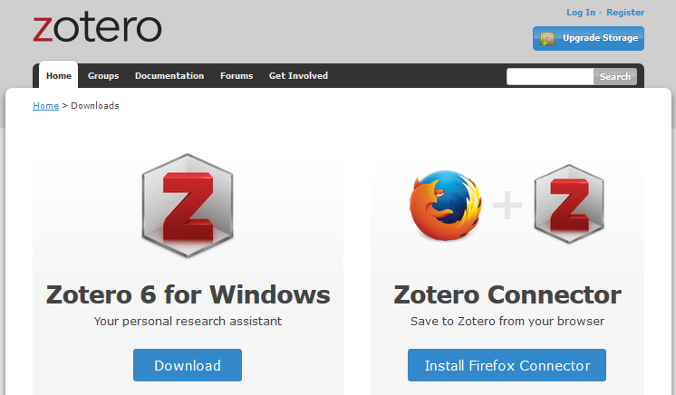
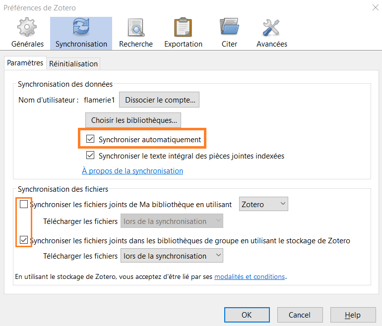
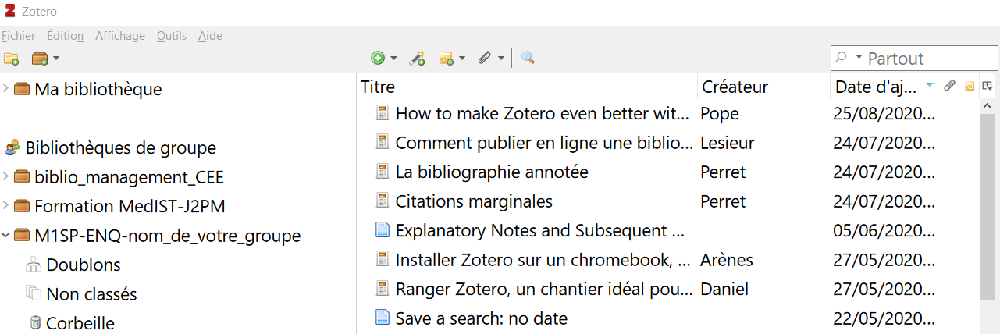

# Introduction à Zotero, votre assistant de recherche personnel : modalité en distanciel : mode d'emploi formation

Pendant cette formation, nous utiliserons plusieurs bibliothèques Zotero. Nous travaillerons notamment tous ensemble dans la même **bibliothèque de groupe** Zotero. Cela nous permettra de mettre en commun les exemples et facilitera l'identification et la résolution des éventuelles difficultés que vous pourrez rencontrer.

Vous trouverez dans ce document les étapes à effectuer avant la formation.

N'hésitez pas à me solliciter avant la formation si vous rencontrez des difficultés pour effectuer l'une des étapes décrites ci-dessous, nous pourrons ainsi résoudre votre problème individuel avant la formation.

**Contact**:  _votre adresse de messagerie_
 
 _lien visio si applicable_

## Support de cours

Vous souhaitez consulter le support de formation à l'avance?

Vous pouvez consulter le support prévu pour la formation en présentiel. Le contenu sera globalement le même, proposé selon un rythme différent et avec d'autres activités.

* [Introduction à Zotero, votre assistant de recherche personnel - COURS au format html](https://github.com/fflamerie/zotero_intro_FR/blob/master/content/zotero_intro_FR_COURS.md)
* [Introduction à Zotero, votre assistant de recherche personnel - COURS au format pdf](https://github.com/fflamerie/zotero_intro_FR/blob/master/content/zotero_intro_FR_COURS.pdf)
* [Introduction à Zotero, votre assistant de recherche personnel - Suppléments](https://github.com/fflamerie/zotero_intro_FR#suppl%C3%A9ments)

## Etape 1 : installez Zotero sur votre ordinateur

![zotero][zotero] [Site web Zotero : Télécharger Zotero](https://www.zotero.org/download/)

Vous devez installer à la fois l'application Zotero **ET** le connecteur Zotero adapté à votre navigateur (Chrome, Firefox ou Edge).

![zotero][zotero] [Documentation Zotero : Installation](https://www.zotero.org/support/fr/installation)

### Comment vérifier si l'installation a fonctionné ?

Pour profiter pleinement de Zotero, le logiciel doit être connecté à votre navigateur et votre traitement de texte (Microsoft Word, LibreOffice Writer).

1. Vérifiez si Zotero est installé en ouvrant l'application sur votre ordinateur.
2. Ouvrez votre navigateur et vérifiez que Zotero apparaît dans la barre supérieure, à côté de la barre de recherche.
3. Ouvrez votre traitement de texte et vérifiez si l'extension Zotero est installée. En général, après l'installation de Zotero, un nouvel onglet apparaît dans votre traitement de texte. En fonction de votre logiciel, Zotero peut aussi être affiché avec d'autres "Compléments".

Si l'installation du module de traitement de texte n'a pas fonctionné, vous pouvez le réinstaller à partir de Zotero lui-même.

1. Ouvrez Zotero.
2. Allez à *Edition > Préférences* (ou *Zotero > Préférences* sur Mac OS).
3. Cliquez sur l'onglet *Citer*.
4. Cliquez sur le deuxième onglet _Traitements de texte_.
5. À ce stade, vous pouvez choisir d'installer ou de réinstaller un ou plusieurs modules pour traitement de texte, en fonction des logiciels de traitement de texte installés sur votre ordinateur.

![zotero][zotero] [Documentation Zotero : Modules pour logiciel de traitement de texte](https://www.zotero.org/support/fr/word_processor_integration)

![zotero][zotero] [Documentation Zotero : Préférences](https://www.zotero.org/support/fr/preferences)

## Etape 2 : créez votre compte Zotero et rejoignez le groupe Zotero de la formation

* Créez  votre compte personnel sur le site zotero.org : https://www.zotero.org/user/register

* Pour rejoindre le groupe Zotero de la formation, rendez vous ensuite  à l'une des 2 adresses suivantes :

https://www.zotero.org/groups/_XXX_groupe1 -> pour le groupe 1, cours du XXX

https://www.zotero.org/groups/_XXX_groupe2 -> pour le groupe 2, cours du XXX

* Cliquez sur _Join_.

* Je validerai ensuite votre inscription.

**/!\\ Vous ne verrez pas encore apparaître ce groupe dans Zotero.**

Pour cela, il faut d'abord que  :

*  je valide votre inscription,
*  vous activiez la synchronisation Zotero.

 C'est l'étape suivante.

## Etape 3 : paramétrer la synchronisation de Zotero

Pour faire apparaître la bibliothèque de groupe dans Zotero, vous devez configurer la synchronisation Zotero.

Ces paramètres sont accessibles depuis les _Préférences_ > _Synchronisation_.

Pour démarrer, nous nous en tenons aux paramètres suivants, après la saisie de votre nom d'utilisateur et de votre mot de passe.

### Synchronisation des données

Cochez _Synchroniser automatiquement_.

### Synchronisation des fichiers

* Ne cochez pas _Synchroniser les fichiers joints de ma bibliothèque en utilisant..._
* Cochez _Synchroniser les fichiers joints dans les bibliothèques en utilisant le stockage de Zotero_.

![zotero][zotero] [Documentation Zotero : Synchronisation](https://www.zotero.org/support/fr/sync)

Une fois la synchronisation activée, vous devriez voir apparaître une nouvelle rubrique "Bibliothèques de groupe" dans Zotero, en-dessous de "Ma bibliothèque".

Dans cette rubrique, devrait s'afficher la bibliothèque de groupe que vous venez de rejoindre.

## Etape 4 : enregistrez les fichiers d'exercice

Nous utiliserons les 2 fichiers suivants pour les exercices au cours de la formation.

* `zotero_citer_APA_MODELE.pdf` [ou `zotero_citer_VANCOUVER_MODELE.pdf` ]
* `zotero_citer_APA_EXERCICE.doc`[ou `zotero_citer_VANCOUVER_EXERCICE.doc`]

Aussi enregistrez-les à un emplacement auquel vous pourrez facilement les retrouver.

[zotero]: img/icone_zotero.png
