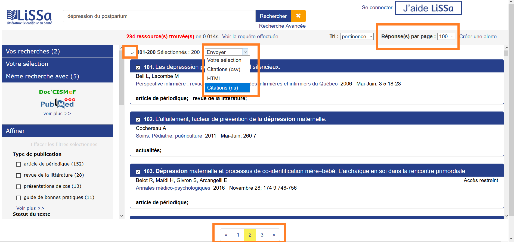
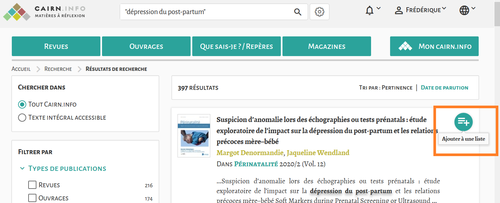
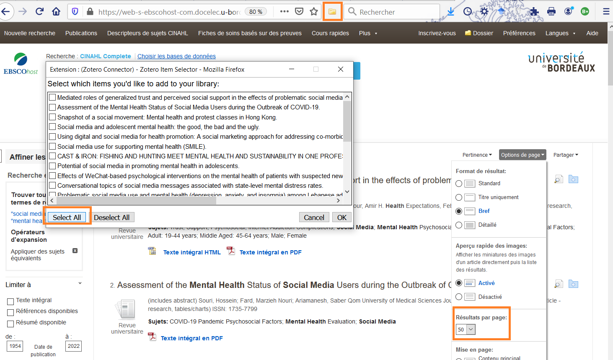
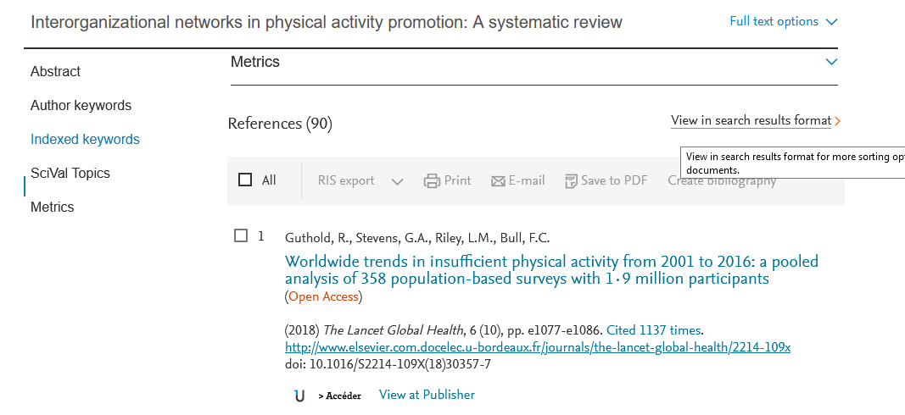
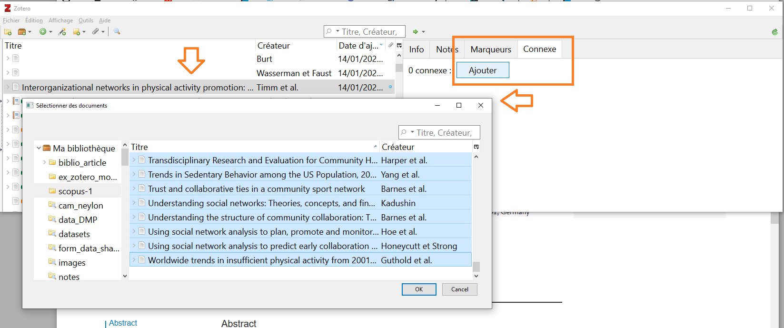
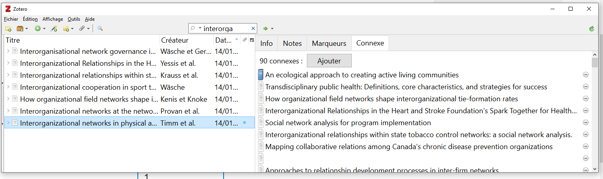
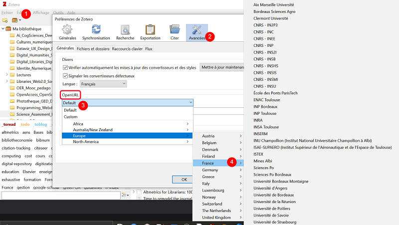

# Trucs et astuces pour optimiser l'utilisation de Zotero dans le contexte d'une revue de littérature ou d'une revue systématique

<!-- MDTOC maxdepth:2 firsth1:0 numbering:0 flatten:0 bullets:1 updateOnSave:1 -->

- [Enregistrer les références par import de fichier plutôt que par le connecteur Zotero (bouton "Save to Zotero" dans votre navigateur)](#enregistrer-les-références-par-import-de-fichier-plutôt-que-par-le-connecteur-zotero-bouton-save-to-zotero-dans-votre-navigateur)   
   - [PubMed](#pubmed)   
   - [Scopus](#scopus)   
   - [Web of Science Core Collection](#web-of-science-core-collection)   
   - [LiSSa](#lissa)   
   - [CAIRN](#cairn)   
   - [PsycINFO, CINAHL et autres bases disponibles via EBSCO](#psycinfo-cinahl-et-autres-bases-disponibles-via-ebsco)   
- [Snowballing, ou enregistrer toutes les références citées par un article](#snowballing-ou-enregistrer-toutes-les-références-citées-par-un-article)   
- [Organiser sa bibliothèque avec des marqueurs](#organiser-sa-bibliothèque-avec-des-marqueurs)   
   - [Créer un marqueur dans un document et lui attribuer une couleur](#créer-un-marqueur-dans-un-document-et-lui-attribuer-une-couleur)   
- [Automatiser et optimiser la recherche du texte intégral](#automatiser-et-optimiser-la-recherche-du-texte-intégral)   
   - [Configuration OpenURL](#configuration-openurl)   
   - [Moteurs de recherche intégrés à Zotero](#moteurs-de-recherche-intégrés-à-zotero)   

<!-- /MDTOC -->

## Enregistrer les références par import de fichier plutôt que par le connecteur Zotero (bouton "Save to Zotero" dans votre navigateur)

Cliquer sur le bouton "Save to Zotero" est la meilleure méthode pour enregistrer des documents dans votre bibliothèque au fil de votre navigation dans les bases de données, lorsqu'il s'agit d'enregistrer un document après l'autre.

Dans le cadre d'une revue de littérature où vous devez enregistrer d'un seul coup depuis une base de données tous les résultats d'une équation de recherche, l'import de fichier est plus adapté, car beaucoup plus rapide.

Voici comment procéder dans différents outils de recherche bibliographique, à partir d'une liste de résultats.

### PubMed

1. Cliquez sur _Send to_ > _Citation manager_.
2. Dans le menu _Selection_ choisissez _All results_.
3. Enregistrez le fichier **.nbib** ainsi généré sur votre ordinateur.
4. Allez ensuite dans Zotero, dans le menu _Fichier_ >_Importer..._ et sélectionnez ce fichier **.nbib**.
5. Suivez les étapes, les références sont automatiquement importées dans votre bibliothèque.

Plus d'infos : [Cours "Introduction à Zotero, votre assistant de recherche personnel" > section " Constituer sa bibliothèque Zotero étape 1, ajouter des documents et des fichiers"](https://github.com/fflamerie/zotero_intro_FR/blob/master/content/zotero_intro_FR_COURS.md#3-constituer-sa-biblioth%C3%A8que-zotero-%C3%A9tape-1-ajouter-des-documents-et-des-fichiers)

### Scopus

Dans la barre de menu grisée juste au-dessus de la liste de résultats :

1. cochez la case _All_ >_Select All_,
2. puis cliquez sur _RIS export_ et choisissez les informations à exporter.

💡 **N'oubliez pas le résumé, il n'est pas inclus par défaut.**

3. Cliquez sur _Export_.
4. Une boîte de dialogue s'affiche, choisissez _Ouvir avec_ > _Zotero_.
5. Les références sont automatiquement importées dans votre bibliothèque.

Lorsque vous incluez le résumé, une limitation à **2'000 références** s'applique pour l'export. Si vous souhaitez exporter plus de 2'000 références, utilisez les filtres par date pour créer des lots par année de publication. Vous serez ainsi sûr d'inclure tous les résultats dans vos exports.

### Web of Science Core Collection

A partir d'une liste de résultats, cliquez directement sur _Export_ pour afficher toutes les options vous permettant de choisir :

* le format d'export,
* puis les références à exporter,
* et les champs à exporter.

Le **format RIS** permet une détection et un import automatiques du fichier dans Zotero. Il peut en revanche s'avérer trop limité si vous souhaitez exporter des champs complémentaires, sélectionnés avec l'option _Custom selection_. Il convient alors de privilégier le format _Plain Text File_ et d'importer le fichier ainsi généré de la même façon que pour PubMed.

Une limitation à **1'000 références** s'applique pour l'export. Comme pour Scopus, il faut procéder par petits lots successifs si vous souhaitez exporter plus de 1'000 références.

### LiSSa

1. Modifiez le nombre le nombre de résultats par page en le passant à la valeur maximale proposée, c'est-à-dire 100 : cela vous permettra de sélectionner d'un seul clic toutes les références affichées sur la page.
2. Une fois les références sélectionnées, cliquez sur _Envoyer_ > _Citations (ris)_.
3. Une boîte de dialogue vous permettra d'importer le fichier dans Zotero.

💡 **Vous pouvez sélectionner consécutivement plusieurs pages de résultats avant de lancer l'export, afin d'enregistrer d'un seul coup plus de 100 références.**

### CAIRN

CAIRN n'autorise pas la sélection multiple sur une liste de résultats, ce qui rend plus laborieux l'import par lot dans Zotero.

💡 **Il est nécessaire de disposer d'un compte personnel sur CAIRN pour pouvoir effectuer les étapes détaillées ci-dessous.**

1. Depuis l'interface de votre compte personnel, créez une liste de lecture. C'est dans cette liste que vous regrouperez toutes les références que vous souhaitez importer dans Zotero.
2. Sur une liste de résultats, cliquez pour chaque référence sur _Ajouter à une liste_, puis choisissez la liste créée à l'étape 1.
3. Dans l'interface de votre compte personnel, affichez la liste de lecture regroupant toutes les références que vous avez sélectionnées.
4. Cliquez sur _Exporter_ > _Zotero (.RIS)_ pour générer le fichier, importé automatiquement par Zotero comme pour LiSSa.

### PsycINFO, CINAHL et autres bases disponibles via EBSCO

A la différence des outils de recherche mentionnés précédemment, l'interface de EBSCOhost ne permet pas des imports par lot de plusieurs centaines de référence.

La manière la plus économique de procéder est d'augmenter le nombre de résultats par page et d'utiliser le connecteur Zotero, en procédant donc par tranche de 50 résultats.

Pour modifier le nombre de résultats par page, cliquer sur _Options de page_ depuis une page de résultats et choisissez la valeur "50" dans le menu déroulant _Résultats par page_. Lorsque vous cliquez sur l'icône "dossier" du connecteur Zotero, il suffit ensuite de choisir l'option _Select all_ pour sélectionner les 50 résultats affichés sur la page en cours.

## Snowballing, ou enregistrer toutes les références citées par un article

Le _snowballing_ fait partie des méthodes de recherche bibliographique utilisables pour une revue de littérature ; elle peut être requise.

Certaines bases de données comme le **Web of Science Core Collection** ou **Scopus** permettent d'enregistrer par lot toutes les références citées par un article. Combiné à la fonctionnalité de **Connexe** de Zotero, cela permet de retrouver rapidement dans une bibliothèque Zotero tous les articles cités par un article donné, et de restituer le lien de citation.

**Les références citées non indexées** dans la base de données sont traitées différemment dans Scopus et Web of Science.

* Dans Scopus elles sont exportées mais incomplètes.
* Dans Web of Science Core Collection elles ne sont pas exportées du tout.

💡 **Il est donc préférable d'utiliser préférentiellement Scopus pour cet usage.**

Voici comment procéder à partir de Scopus, la procédure est similaire pour le Web of Science.

1. Sur la page d'un article, allez à la rubrique _References_ et cliquez sur le lien permettant d'afficher la liste des références sous la forme d'une liste de résultats. Dans Scopus il s'agit de _View in search results format_. Vous pouvez ensuite effectuer l'export de toutes les références comme décrit précédemment.

2. Dans votre bibliothèque Zotero, sélectionnez l'article dont vous venez d'importer la bibliographie, puis cliquez sur _Ajouter_ dans l'onglet _Connexe_ et sélectionnez toutes les références que vous venez d'importer.

3. Un lien réciproque est créé entre l'article et chacune des références qu'il cite. Ces liens sont affichés dans l'onglet _Connexe_ ; ils vous permettent de naviguer de l'article aux références qu'il cite et inversement.

 

## Organiser sa bibliothèque avec des marqueurs

Zotero dispose de plusieurs outils pour organiser une bibliothèque :

* les collections -> plus ou moins des dossiers, plutôt des listes de lecture,
* les marqueurs -> des mots-clés,
* les recherches enregistrées -> des collections dynamiques,
* les documents connexes -> pour établir des liens entre les documents,
* les notes -> indexées par le moteur de recherche de Zotero, saisies dans un éditeur html permettant une mise en forme.

Pourquoi privilégier les marqueurs plutôt que les collections?

2 raisons principales :

* **Lisibilité** : grâce à l'onglet "Marqueurs" du volet de droite vous visualisez immédiatement tous les marqueurs associés à un document ; grâce aux **marqueurs colorés** vous visualisez rapidement tous les documents associés à un marqueur.
* **Portabilité** : les marqueurs font partie des informations bibliographiques du document et sont ainsi, par exemple, exportés au même titre que toutes les autres informations bibliographiques lorsque vous exportez des documents dans un fichier au format .ris, . csv, etc. Les collections et les recherches enregistrées relèvent en revanche de **l'interface** de votre bibliothèque, l'information du classement dans une collection n'est pas enregistrée en tant qu'information bibliographique du document.

Plus d'infos : [Cours "Introduction à Zotero, votre assistant de recherche personnel" > section "Constituer sa bibliothèque Zotero étape 2, organiser le contenu"](https://github.com/fflamerie/zotero_intro_FR/blob/master/content/zotero_intro_FR_COURS.md#4-constituer-sa-biblioth%C3%A8que-zotero-%C3%A9tape-2-organiser-le-contenu)

### Créer un marqueur dans un document et lui attribuer une couleur

_Source : [Mini-site Zotero Lausanne > Tutoriel Zotero](https://lausannecitationstyle.github.io/support/3.html)_

## Automatiser et optimiser la recherche du texte intégral

Zotero dispose de fonctionnalités par défaut pour rechercher et enregistrer automatiquement le texte intégral, telles que les suivantes.

* **L'enregistrement automatique du PDF présent sur une page web** lorsque vous utilisez le connecteur Zotero (bouton Zotero dans votre navigateur).
* La détection et l'enregistrement automatiques du **proxy de l'université** pour vous rediriger vers les accès souscrits par l'université lorsque vous naviguez sur les sites des éditeurs - voir [Documentation Zotero : Les préférences du connecteur Zotero > Préférences pour les serveurs mandataires](https://www.zotero.org/support/fr/connector_preferences?do=#preferences_pour_les_serveurs_mandataires).
* La recherche automatique de **PDF disponibles en libre accès** grâce à Unpaywall - [description de la fonctionnalité sur le blog Zotero francophone](https://zotero.hypotheses.org/2130).

Deux fonctionnalités complémentaires vous permettent d'augmenter ces fonctions de recherche. Elles sont toutes les 2 accessibles depuis **le menu _Localiser_**, c'est-à-dire la flèche verte en haut du volet de droite dans votre bibliothèque Zotero. Il s'agit de :

* la **configuration OpenURL** pour l'Université de Bordeaux,
* la personnalisation des **moteurs de recherche intégrés à Zotero**.

### Configuration OpenURL

Pour la configuration OpenURL, il suffit :

* d'aller à l'onglet _Avancées_ > _Générales_ des _Préférences_,
* dans la rubrique _OpenURL_, ouvrir le menu déroulant et naviguer dans la liste géographique jusqu'à l'entrée "Université de bordeaux".

* En cliquant sur le menu _Localiser_ > _Rechercher dans la bibliothèque_, vous afficherez le document dans Babord+ avec toutes les options d'accès de l'université de Bordeaux.

### Moteurs de recherche intégrés à Zotero

Ces moteurs de recherche vous permettent de lancer une recherche dans diverses sources pour trouver un fichier de texte intégral disponible sur un site web personnel  (moteurs Google, Google Scholar), ou pour compléter les informations bibliographiques de vos documents (moteur Sudoc pour les livres et les thèses, moteur PubMed pour les articles).

Pour en savoir plus concernant la personnalisation des moteurs de recherche et découvrir d'autres moteurs que ceux installés dans le fichier de moteurs préconfiguré ci-dessous, consultez le billet du blog Zotero francophone [Les moteurs de recherche intégrés à Zotero](https://zotero.hypotheses.org/3388).

#### Fichier de moteurs de recherche préconfiguré

Vous trouverez dans le fichier [engines_BX-svs.json](https://raw.githubusercontent.com/fflamerie/zotero_intro_FR/master/content/engines_BX-svs.json) les moteurs de recherche ci-dessous.

* Bordeaux + - Université de Bordeaux
* Crossref
* Google Scholar
* Google Scholar - Title Only
* Google
* SUDOC
* SUDOC - auteur(s)/titre
* SUDOC - auteur(s)/titre/ISBN
* SUDOC - ISBN
* PubMed DOI
* PubMed (title + author)

Voici comment procéder pour installer ce fichier dans Zotero.

1. 📥 Téléchargez le fichier en faisant un clic droit sur ce lien : [engines_BX-svs.json](https://raw.githubusercontent.com/fflamerie/zotero_intro_FR/master/content/engines_BX-svs.json) et en choisissant "Enregistrer le lien sous…" ou "Enregistrer la cible du lien sous...".

2. Renommez-le ensuite en `engines.json`.

3. 🖱️ Copiez-le dans le répertoire `locate` de votre répertoire de données Zotero, en remplacement du fichier existant.

ℹ️ Pour accéder à votre répertoire de données Zotero depuis les _Préférences_ de Zotero, cliquez sur :

_Avancées_ > _Fichiers et dossiers_ > _Ouvrir le répertoire de données_

4. Redémarrez Zotero : lorsque vous sélectionnez un document de votre bibliothèque, vous devez voir s'afficher vos nouveaux moteurs de recherche sous le menu _Localiser_.
